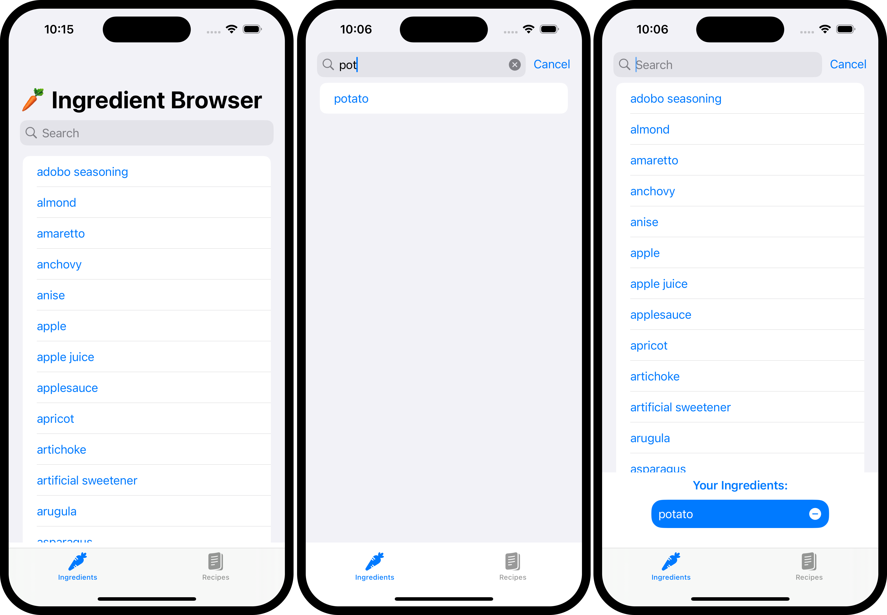
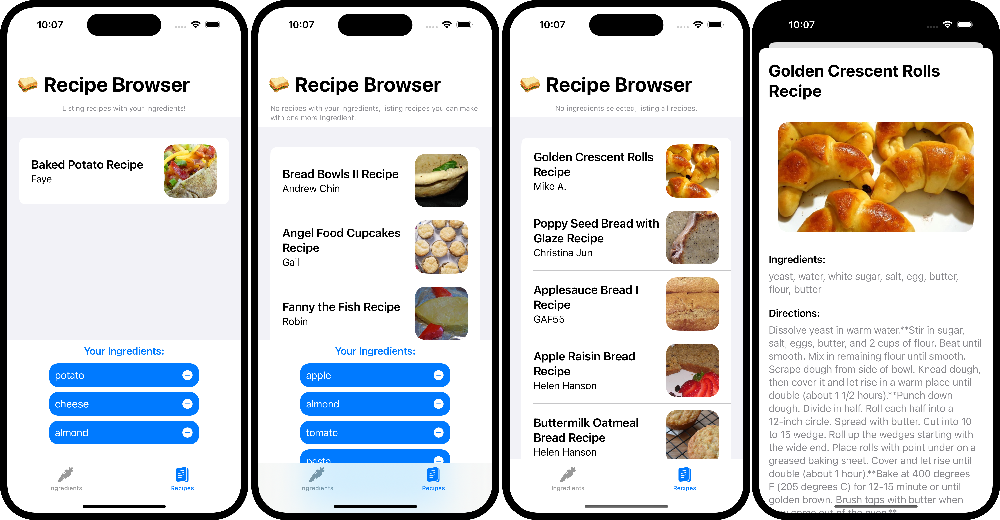

# RecipeBrowser

An iOS app programmed with Swift using Firebase database.
Users can search recipes and filter the recipes by ingredients.

## Technologies

**App:** Swift

**Database:** Firebase

## Ingredient selection

Search ingredients & Select ingredients:

## Recipe selection

Search recipes and click on them for a detailed view:

